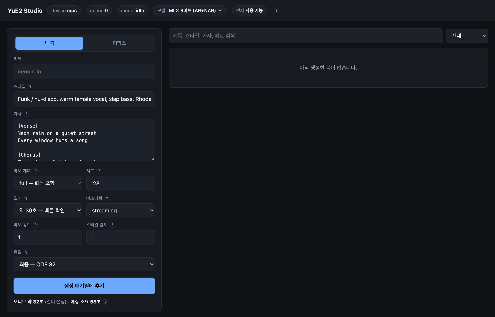

# YuE2 Studio



```bash
./start
```

## 사용법

### 1. 켜기

터미널에서 `./start` 를 입력하면 스튜디오가 브라우저에 열립니다.

처음 한 번은 AI 모델 파일(약 13GB)을 내려받느라 오래 걸립니다. 다음부터는 금방 켜집니다.

### 2. 새 노래 만들기

왼쪽의 **새 곡** 탭에서 칸을 채우고 **생성 대기열에 추가** 를 누르면 됩니다.

| 칸 | 무엇을 쓰나요 |
|---|---|
| 제목 | 노래 이름. 비워 둬도 됩니다. |
| 스타일 | 어떤 느낌의 노래인지 영어로 적어요. 장르, 악기, 목소리, 빠르기(BPM)를 쉼표로 이어 쓰면 됩니다. 예: `K-pop, bright female vocal, piano, 120 BPM` |
| 가사 | 부를 가사. `[Verse]`(1절), `[Chorus]`(후렴)처럼 줄머리에 표시를 달면 노래 구성이 그렇게 짜여요. |
| 길이 | 처음에는 **약 30초** 로 짧게 들어보는 걸 추천해요. |

나머지 칸은 처음에는 건드리지 않아도 됩니다. 칸 이름 옆 **?** 에 마우스를 올리면 설명이 나와요.

버튼 아래에 **예상 소요 시간** 이 나옵니다. 30초짜리 노래는 1분쯤 걸려요.

### 3. 기다리기

오른쪽 목록에 노래가 생기고, 지금 어느 단계인지와 남은 시간이 보입니다.
노래는 **한 번에 하나씩** 만들어지니, 여러 개를 넣으면 순서대로 차례를 기다려요.
그만두고 싶으면 **취소** 를 누르세요.

### 4. 듣고 고르기

다 되면 목록에 플레이어가 생깁니다.

- **▶ 재생** 으로 들어보세요.
- 마음에 들면 **☆** 을 눌러 즐겨찾기에 넣어요.
- **다운로드** 로 파일을 받을 수 있어요.
- 제목을 클릭하면 이름을 바꿀 수 있고, **메모** 에 한 줄 적어 둘 수도 있어요.
- 마음에 안 들면 **시드** 숫자를 바꿔서 다시 만들어 보세요. 같은 가사라도 다른 노래가 나와요.

### 5. 음질 올리기

빨리 들어보려고 **음질** 을 **초안** 으로 만들었다면, 마음에 든 노래에서
**이 곡 그대로 고음질로** 를 누르세요. 멜로디와 노래는 그대로 두고 소리만 깨끗하게 다시 만들어요.

길이가 짧아서 노래가 중간에 끊겼다면 **이어서 풀버전으로** 를 누르세요.
앞부분은 그대로 두고 뒷부분을 이어서 만들어 줘요.

### 6. 리믹스 — 있는 노래를 다른 스타일로

**리믹스** 탭은 이미 있는 노래의 멜로디를 따서 새 반주와 목소리로 다시 부르게 하는 기능이에요.

1. **오디오 파일** 에 원곡 파일(mp3, wav 등)을 넣습니다.
2. **스타일** 에 새로 입힐 느낌을 적어요. 예: `Bossa nova cover, soft female vocal, nylon guitar`
3. **가사** 를 적고 **전사하고 리믹스 대기열에 추가** 를 누릅니다.

스튜디오가 먼저 원곡을 듣고 악보로 옮겨 적은 다음, 그 악보로 노래를 새로 만들어요.
목록에서 원곡 녹음도 같이 들어볼 수 있어요.

원곡 멜로디를 너무 똑같이 따라 한다 싶으면 **악보 강도** 를 `0.5` 쯤으로 낮춰 보세요.
대신 만드는 데 시간이 더 걸려요.

> 리믹스를 쓰려면 악보로 옮겨 적는 기능을 따로 설치해야 해요. 위쪽에 **전사 미설치** 라고
> 나오면 `./start --with-transcription` 으로 한 번 켜 주세요.

### 7. 소리 크기 맞추기 (마스터링)

만든 노래는 자동으로 음악 앱에서 듣기 좋은 크기로 다듬어집니다(**streaming**).
목록의 **다시 마스터링…** 에서 다른 방식으로 바꿀 수 있어요.

- **loud** — 더 크고 힘 있게
- **gentle** — 조금 작고 자연스럽게
- 플레이어 옆 선택 칸에서 **원본** 을 고르면 다듬기 전 소리를 들을 수 있어요.

### 알아 두기

- 여기서 쓰는 AI 모델은 **비상업적 용도** 로만 쓸 수 있어요. 만든 노래를 팔거나 광고에 쓰면 안 됩니다.
- 남의 노래를 리믹스해도 그 노래가 내 것이 되지는 않아요.
- 설정한 내용은 브라우저가 기억해서 다음에 열어도 그대로 남아 있어요.

---

설치 옵션, 성능 측정, 내부 구조, API 는 [기술 문서](docs/TECHNICAL.md) 에 있습니다.
